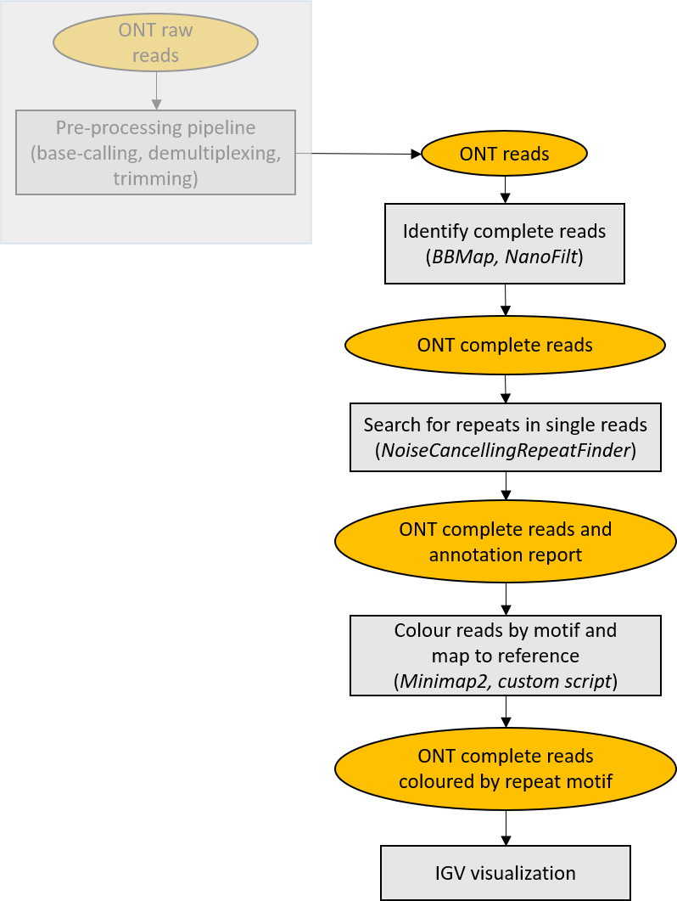

# MosaicViewer_FMR1

**MosaicViewer_FMR1** is a pipeline for schematic visualization of alleles with somatic mosaicism. Due to mosaicism, long sequencing reads can not be collapsed into an accurate consensus sequence. Therefore, only repeat annotation of each single read can be performed. MosaicViewer_FMR1 integrates tools for extracting "complete" reads, namely with both repeat flanking regions, performing repeat annotation of noisy long reads, performing alignment to left and right flanking regions, and generating "simplified" reads, for easier identification of alternative motifs in IGV visualization. The pipeline has only been used for FMR1 alleles.

<p align="center">
  
</p>


## Getting started

**Prerequisites**

* Miniconda3.
Tested with conda 4.9.2.
```which conda``` should return the path to the executable.
If you don't have Miniconda3 installed, you could download and install it with:
```
wget https://repo.anaconda.com/miniconda/Miniconda3-latest-Linux-x86_64.sh
chmod 755 Miniconda3-latest-Linux-x86_64.sh
./Miniconda3-latest-Linux-x86_64.sh
```

* A fastq file containing reads from one sample. Tested with files produced with Guppy v4.2.
* A fasta file containing reference sequence (e.g. hg38)
* Coordinates of flanking regions (e.g. regions flanking the repeat)

**Installation**

```
git clone https://github.com/MaestSi/MosaicViewer_FMR1.git
cd MosaicViewer_FMR1
chmod 755 *
./install.sh
```

A conda environment named _MosaicViewer\_env_ is created, where seqtk, minimap2, samtools, NoiseCancellingRepeatFinder, BBMap and R with package Biostrings are installed. Another conda environment named _NanoFilt\_env_ is created, where NanoFilt is installed. 
Then, you can open the **config_MosaicViewer.sh** file with a text editor and set the variables _PIPELINE_DIR_ and _MINICONDA_DIR_ to the value suggested by the installation step.

## Usage
As a first step, open the **config_MosaicViewer.sh** file with a text editor and set all the variables. Depending on the reference coordinates set in the file, in-silico PCR primers and flanking regions for performing left or right alignment are extracted.

<p align="center">
  
</p>

**MosaicViewer.sh**

Usage: ./MosaicViewer.sh

Note: the file **config_MosaicViewer.sh** should be in the same directory. It currently supports CGG repeat motif.

Outputs:

* $SAMPLE_NAME"\_trimmed\_"$SIDE".bam": bam file containing expanded reads aligned to $GENE_NAME"\_masked\_reference\_"$SIDE".fasta"
* $SAMPLE_NAME"\_trimmed\_simplified\_"$SIDE"\_final.bam": bam file containing simplified version of expanded reads aligned to $GENE_NAME"\_masked\_reference\_"$SIDE".fasta", where the sequence of each identified repeat has been replaced with a single repeated nucleotide (CGG -> GGG; other -> N)
* Other temporary files

## Results visualization

For example, this is how the right alignment of trimmed reads (with or without colouring based on annotated repeats) would look like.

<p align="center">
  
</p>

## Citation

If this tool is useful for your work, please consider citing our [manuscript](https://www.frontiersin.org/articles/10.3389/fgene.2021.743230/full).

Grosso V, Marcolungo L, Maestri S, Alfano M, Lavezzari D, Iadarola B, Salviati A, Mariotti B, Botta A, D'Apice MR, Novelli G, Delledonne M and Rossato M. Characterization of FMR1 repeat-expansion and intragenic variants by indirect sequence capture. Front. Genet. doi: 10.3389/fgene.2021.743230.

For further information, please refer to the following manuscripts:

Harris RS, Cechova M, Makova KD. Noise-cancelling repeat finder: uncovering tandem repeats in error-prone long-read sequencing data. Bioinformatics. 2019 Nov 1;35(22):4809-4811. doi: 10.1093/bioinformatics/btz484. PMID: 31290946; PMCID: PMC6853708.

De Coster W, D'Hert S, Schultz DT, Cruts M, Van Broeckhoven C. NanoPack: visualizing and processing long-read sequencing data. Bioinformatics. 2018;34(15):2666-2669. doi:10.1093/bioinformatics/bty149

Li H. Minimap2: pairwise alignment for nucleotide sequences. Bioinformatics. 2018 Sep 15;34(18):3094-3100. doi: 10.1093/bioinformatics/bty191. PMID: 29750242; PMCID: PMC6137996.

R Core Team (2017). R: A language and environment for statistical computing. R Foundation for Statistical Computing, Vienna, Austria. URL https://www.R-project.org/.

Li H, Handsaker B, Wysoker A, Fennell T, Ruan J, Homer N, Marth G, Abecasis G, Durbin R; 1000 Genome Project Data Processing Subgroup. The Sequence Alignment/Map format and SAMtools. Bioinformatics. 2009 Aug 15;25(16):2078-9. doi: 10.1093/bioinformatics/btp352. Epub 2009 Jun 8. PMID: 19505943; PMCID: PMC2723002.

Thorvaldsdóttir H, Robinson JT, Mesirov JP. Integrative Genomics Viewer (IGV): high-performance genomics data visualization and exploration. Brief Bioinform. 2013 Mar;14(2):178-92. doi: 10.1093/bib/bbs017. Epub 2012 Apr 19. PMID: 22517427; PMCID: PMC3603213.

[BBMap – Bushnell B.](sourceforge.net/projects/bbmap/)

[seqtk](https://github.com/lh3/seqtk)
